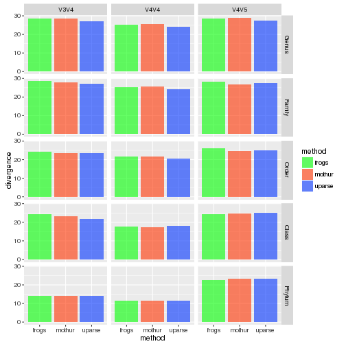
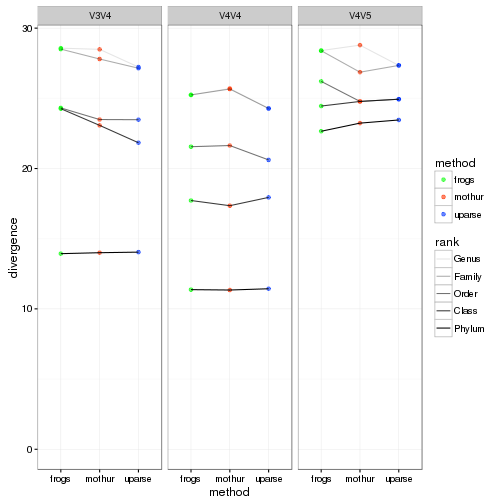
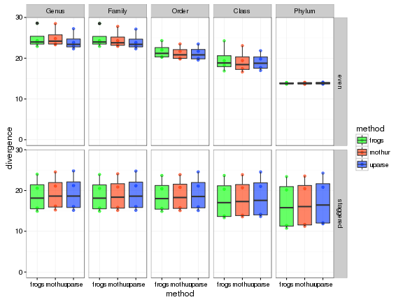
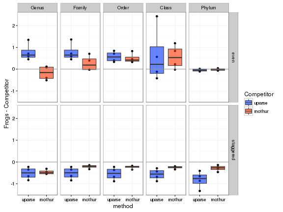
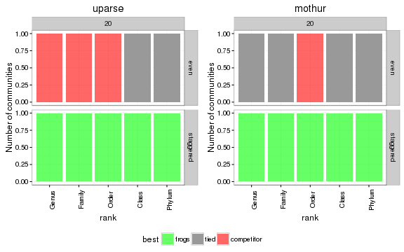
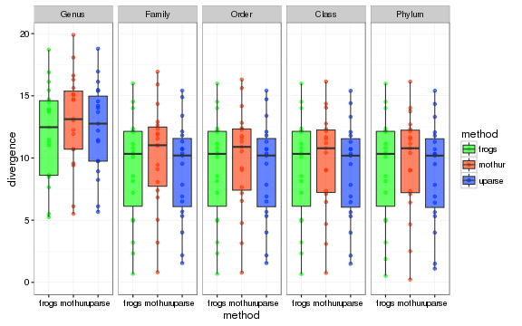
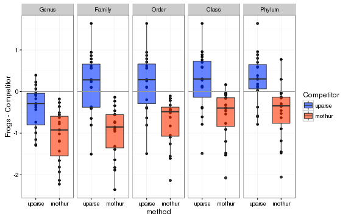
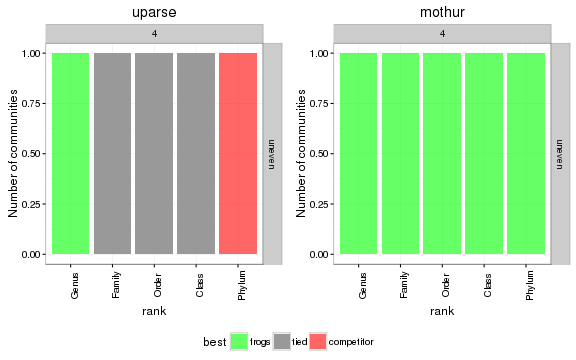
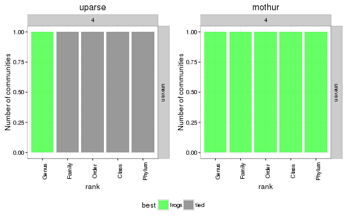

# Introduction 

Ce document R markdown a vocation à documenter la procédure suivie pour comparer les résultats de FROGS, Mothur et UParse sur communautés synthétiques. En particulier, on cherche à savoir si Frogs permet d'avoir une vision taxonomique des communautés bactériennes plus fidèle que Mothur et UParse. 

# Import et préparation des données

## Chargement des packages

On commence par charger quelques packages utiles:
- reshape et dplyr pour la manipulation de données
- ggplot2, grid et gridExtra pour la visualisation
- PMCMR pour effectuer des tests de Dunn (version non paramétrique du test post-hoc de Tukey)


```r
library(ggplot2)
library(grid)
library(gridExtra)
library(reshape2)
library(PMCMR) ## The Pairwise Multiple Comparison of Mean Ranks Package (PMCMR)
library(multcomp)
library(dplyr)
```

et une fonction utilitaire pour combiner plusieurs graphiques ggplot:

```r
## http://stackoverflow.com/questions/13649473/add-a-common-legend-for-combined-ggplots
grid_arrange_shared_legend <- function(..., ncol = 1) {
  require(grid)
    plots <- list(...)
    if (length(plots) == 1) { ## already a list of plots
      plots <- plots[[1]]
    }
    g <- ggplotGrob(plots[[1]] + theme(legend.position="bottom"))$grobs
    legend <- g[[which(sapply(g, function(x) x$name) == "guide-box")]]
    lheight <- sum(legend$height)
    grid.arrange(
        do.call(arrangeGrob, c(lapply(plots, function(x)
            x + theme(legend.position="none")), ncol = ncol)),
        legend,
        nrow = 2,
        heights = unit.c(unit(1, "npc") - lheight, lheight))
}
generate_barplot <- function(p, data, vbl, ylab = "share of communities") {
  levs <- levels(data[[vbl]])
  result <- lapply(levs, 
                   function(lev) { p + geom_bar(data = filter_(data, 
                                                          lazyeval::interp(~variable == value, variable = as.name(vbl), value = lev))) + 
                                        labs(y = ylab) + ggtitle(lev)})
  return(result)
}

generate_pointplot <- function(p, data, vbl, ylab = "Divergence competitor") {
  levs <- levels(data[[vbl]])
  result <- lapply(levs, 
                   function(lev) { p + geom_point(data = filter_(data, 
                                                          lazyeval::interp(~variable == value, variable = as.name(vbl), value = lev))) + 
                                        labs(y = ylab) + ggtitle(lev)})
  return(result)
}
```

Et une palette manuelle de couleurs pour les graphiques. 

```r
manual.palette <- c("frogs"      = rgb(0, 1, 0, alpha = 0.6, maxColorValue = 1), 
                    "tied"       = "grey60", 
                    "competitor" = rgb(1, 0, 0, alpha = 0.6, maxColorValue = 1), 
                    "mothur"     = rgb(1, 0.2, 0, alpha = 0.6, maxColorValue = 1), 
                    "mothur_sop" = rgb(1, 0.5, 0, alpha = 0.6, maxColorValue = 1),                   
                    "uparse"     = rgb(0, 0.2, 1, alpha = 0.6, maxColorValue = 1), 
                    "uparse_sop" = rgb(0, 0.5, 1, alpha = 0.6, maxColorValue = 1))
```


## Import des données

On importe ensuite les données

```r
data <- read.table("reel.tsv", sep = "\t", header = TRUE)
head(data)
```

```
##   databank nb_OTU   dataset set_number amplicon abundance_law method
## 1     utax   20sp dataset_1       set1     V4V4          even  frogs
## 2     utax   20sp dataset_1       set1     V4V4          even mothur
## 3     utax   20sp dataset_1       set1     V4V4          even uparse
## 4     utax   20sp dataset_1       set1     V4V5          even  frogs
## 5     utax   20sp dataset_1       set1     V4V5          even mothur
## 6     utax   20sp dataset_1       set1     V4V5          even uparse
##      Genus   Family    Order    Class   Phylum
## 1 25.24391 25.24391 21.55401 17.72098 11.37121
## 2 25.69997 25.66269 21.63806 17.35146 11.34421
## 3 24.27770 24.27770 20.61348 17.94283 11.43447
## 4 28.40162 28.39361 26.20869 24.45027 22.65464
## 5 28.78934 26.86227 24.78145 24.77823 23.23392
## 6 27.34537 27.34537 24.93693 24.93693 23.45804
```

## Transformation des données

Les différentes réponses d'intéret sont Genus, Family, Order, Class, Phylum stockées sur plusieurs colonnes. Avant toute chose, on change la variale nb_OTU en une variable numérique (pour retrouver un ordonnancement naturel) puis on sépare les informations sur le nombre de faux positifs et de faux négatifs dans un tableau distinct. 


```r
data$nb_OTU <- as.numeric(sub("sp", "", data$nb_OTU))
```


Dans notre contexte on cherche à comparer les performances de mothur et silva à celles de frogs en termes de divergence à plusieurs niveaux taxonomiques. On va donc réorganiser le tableau en considérant que chaque "unité expérimentale"" est un jeu de données décrit à un niveau taxonomique donné par une méthode donnée et qu'on mesure dessus la divergence entre compositions mesurée et théorique. Cette structure est utile pour la visualtion et les anovas. 


```r
data <- data %>% melt(id.vars = c("databank", "nb_OTU", "dataset", 
                                  "set_number", "amplicon", "abundance_law", "method"), 
                      value.name = "divergence", 
                      variable.name = "rank")
head(data)
```

```
##   databank nb_OTU   dataset set_number amplicon abundance_law method  rank
## 1     utax     20 dataset_1       set1     V4V4          even  frogs Genus
## 2     utax     20 dataset_1       set1     V4V4          even mothur Genus
## 3     utax     20 dataset_1       set1     V4V4          even uparse Genus
## 4     utax     20 dataset_1       set1     V4V5          even  frogs Genus
## 5     utax     20 dataset_1       set1     V4V5          even mothur Genus
## 6     utax     20 dataset_1       set1     V4V5          even uparse Genus
##   divergence
## 1   25.24391
## 2   25.69997
## 3   24.27770
## 4   28.40162
## 5   28.78934
## 6   27.34537
```

On va aussi construire un autre tableau qui intégre le fait que frogs constitue notre méthode de référence et qu'on compare, sur chaque échantillon, une méthode concurrente à la méthode de référence. 

```r
data.2 <- data %>% dcast(databank + nb_OTU + dataset + set_number + amplicon + abundance_law + rank ~ method) %>% 
  melt(id.vars = c("databank", "nb_OTU", "dataset", "set_number", "amplicon", "abundance_law", "rank", "frogs"), 
       value.name = "divergence", 
       variable.name = "method")
```

```
## Using divergence as value column: use value.var to override.
```

```r
head(data.2)
```

```
##   databank nb_OTU   dataset set_number amplicon abundance_law   rank
## 1     utax      4 dataset_1       set1     V3V4        uneven  Genus
## 2     utax      4 dataset_1       set1     V3V4        uneven Family
## 3     utax      4 dataset_1       set1     V3V4        uneven  Order
## 4     utax      4 dataset_1       set1     V3V4        uneven  Class
## 5     utax      4 dataset_1       set1     V3V4        uneven Phylum
## 6     utax      4 dataset_1      set10     V3V4        uneven  Genus
##      frogs method divergence
## 1 11.01622 mothur   11.93760
## 2 10.79713 mothur   11.54469
## 3 10.79713 mothur   11.30652
## 4 10.79713 mothur   11.19261
## 5 10.79713 mothur   11.15636
## 6 12.47436 mothur   13.03542
```
Dans data.2, *divergence* correspond à la divergence mesurée sur une méthode concurrente (renseignée dans *method*) tandis que *frogs* correspond à la divergence mesurée par FROGS. 

Finalement on change l'ordre des méthodes pour que les panels soient dans le bon ordre dans les graphiques

```r
data.2 <- data.2 %>% mutate(method = factor(method, levels = c("uparse", "mothur")))
```


## Visualisation des données

Contrairement aux données simulées, les données issues de communautés réelles ne répondent pas à un plan factoriel parfait (cf ci dessous) et le niveau de réplication est un peu plus faible. On va donc procéder à des analyses un peu différentes, plus localisées. 


```r
data.2 %>% group_by(nb_OTU, amplicon, abundance_law) %>% summarize(count = n() / 10) %>% print()
```

```
## Source: local data frame [5 x 4]
## Groups: nb_OTU, amplicon [?]
## 
##   nb_OTU amplicon abundance_law count
##    (dbl)   (fctr)        (fctr) (dbl)
## 1      4     V3V4        uneven    19
## 2     20     V3V4          even     4
## 3     20     V3V4     staggered     4
## 4     20     V4V4          even     1
## 5     20     V4V5          even     1
```

### Effet de la région

La région V4V5 est la pire en terme de divergence, la V4V4 la meilleure et comme attendu la divergence est plus importante pour des classes fines (Genus) que pour des classes grossières (Phylum). 


```r
p <- ggplot(filter(data, abundance_law == "even" & set_number == "set1"), aes(x = method, y = divergence, fill = method)) + geom_bar(stat = "identity") + facet_grid(rank~amplicon) + scale_fill_manual(values = manual.palette)
plot(p)
```



Une représentation alternative permet de mieux voir les différences: uparse fait mieux que frogs et mothur pour les classes fines et pareil ou moins bien pour les classes grossières. Comme il n'y a qu'un échantillon par amplicon pour chaque méthode, il est impossible de faire des statistiques. 

```r
p <- ggplot(filter(data, abundance_law == "even" & set_number == "set1"), aes(x = method, y = divergence)) + geom_point(aes(color = method)) + geom_line(aes(group = rank, alpha = rank)) + facet_grid(~amplicon) + scale_color_manual(values = manual.palette) + scale_y_continuous(lim = c(0, NA)) + theme_bw()
plot(p)
```



### Effet de la distribution 

On s'intéresse ici uniquement aux échantillons V3V4 pour 20 espèces et on va comparer les distributions uniformes (*even*) et échelonnées (*staggered*). La distribution échelonnée permet d'avoir des images plus fidèles que la distribution uniforme à des niveaux fin et vice-versda à des niveaux grossiers. Notons que le niveau de divergence observé ici est probablement dû aux limites de la technologie (baiais de préparation, amplification, nombre de copies, etc) plus qu'aux limites de chacune des méthodes. 

```r
p <- ggplot(filter(data, amplicon == "V3V4" & nb_OTU == 20), aes(x = method, y = divergence)) + geom_point(aes(color = method)) + geom_boxplot(aes(fill = method)) + facet_grid(abundance_law~rank) + scale_color_manual(values = manual.palette) + scale_fill_manual(values = manual.palette) + scale_y_continuous(lim = c(0, NA)) + theme_bw()
plot(p)
```



On peut aussi s'intéresser plus explicitement aux différences entre frogs et ses concurrents: 

```r
p <- ggplot(filter(data.2, amplicon == "V3V4" & nb_OTU == 20), aes(x = method, y = frogs - divergence)) + geom_point() + geom_boxplot(aes(fill = method)) + facet_grid(abundance_law ~ rank) + scale_color_manual(name = "Competitor", values = manual.palette) + scale_fill_manual(name = "Competitor", values = manual.palette) + theme_bw() + geom_hline(yintercept = 0, col = "grey60") + ylab("Frogs - Competitor")
plot(p)
```



On peut enfin tester si les différences sont significatives en faisant un test de student pairé. On délaisse ici l'approche non-paramétrique puisqu'on a trop peu d'échantillon (4) par modalité pour avoir de la puissance avec un test de Mann-Whitney. Et dans tous les cas, même si la différence est statistiquement significative, le graphique précédent montre qu'elle de l'ordre du demi-pourcent de divergence, très faible par rapport aux divergence de base atteintes par chaque méthode. 

```r
data.t.test <- data.2 %>% filter(amplicon == "V3V4", nb_OTU == 20) %>% 
  group_by(databank, nb_OTU, dataset, amplicon, abundance_law, rank, method) %>% 
  summarize(pval = t.test(frogs, divergence, paired = TRUE)$p.value, 
            measure = t.test(frogs, divergence, paired = TRUE)$estimate) %>% 
  mutate(best = ifelse(measure >0, "competitor", "frogs")) %>% 
  mutate(best = ifelse(pval < 0.05, best, "tied")) %>%
  mutate(best = factor(best, levels = c("frogs", "tied", "competitor")))
data.t.test %>% select(measure, pval, best) %>% head()
```

```
## Source: local data frame [6 x 9]
## Groups: databank, nb_OTU, dataset, amplicon, abundance_law, rank [3]
## 
##   databank nb_OTU   dataset amplicon abundance_law   rank    measure
##     (fctr)  (dbl)    (fctr)   (fctr)        (fctr) (fctr)      (dbl)
## 1     utax     20 dataset_1     V3V4          even  Genus  0.7721820
## 2     utax     20 dataset_1     V3V4          even  Genus -0.1776946
## 3     utax     20 dataset_1     V3V4          even Family  0.7762553
## 4     utax     20 dataset_1     V3V4          even Family  0.2642508
## 5     utax     20 dataset_1     V3V4          even  Order  0.5716949
## 6     utax     20 dataset_1     V3V4          even  Order  0.4974172
## Variables not shown: pval (dbl), best (fctr)
```


```r
p <- ggplot(mapping = aes(x = rank, fill = best)) + facet_grid(abundance_law ~ nb_OTU) + theme_bw() + scale_fill_manual(values = manual.palette) + theme(axis.text.x = element_text(angle = 90))
plot.list <- generate_barplot(p, data = data.t.test, vbl = "method", ylab = "Number of communities")
grid_arrange_shared_legend(plot.list, ncol = 2)
```



### Comparaison sur des communautés de 4 espèces

On s'intéresse ici uniquement aux échantillons V3V4 pour 4 espèces (distribution *uneven* pour tous) et on va comparer les 3 mérthodes dessus. 

```r
p <- ggplot(filter(data, nb_OTU == 4), aes(x = method, y = divergence)) + geom_point(aes(color = method)) + geom_boxplot(aes(fill = method)) + facet_grid(~rank) + scale_color_manual(values = manual.palette) + scale_fill_manual(values = manual.palette) + scale_y_continuous(lim = c(0, NA)) + theme_bw()
plot(p)
```


Là encore la variabilité entre échantillons est très grande et on va s'intéresser plus explicitement aux différences entre frogs et ses concurrents: 

```r
p <- ggplot(filter(data.2, nb_OTU == 4), aes(x = method, y = frogs - divergence)) + geom_point() + geom_boxplot(aes(fill = method)) + facet_grid(~ rank) + scale_color_manual(name = "Competitor", values = manual.palette) + scale_fill_manual(name = "Competitor", values = manual.palette) + theme_bw() + geom_hline(yintercept = 0, col = "grey60") + ylab("Frogs - Competitor")
plot(p)
```



On peut enfin tester si les différences sont significatives en faisant un test de student pairé. Même si la différence est statistiquement significative, le graphique précédent montre qu'elle de l'ordre du pourcent de divergence, très faible par rapport aux divergence de base atteintes par chaque méthode. 

```r
data.t.test <- data.2 %>% filter(nb_OTU == 4) %>% 
  group_by(databank, nb_OTU, dataset, amplicon, abundance_law, rank, method) %>% 
  summarize(pval = t.test(frogs, divergence, paired = TRUE)$p.value, 
            measure = t.test(frogs, divergence, paired = TRUE)$estimate) %>% 
  mutate(best = ifelse(measure >0, "competitor", "frogs")) %>% 
  mutate(best = ifelse(pval < 0.05, best, "tied")) %>%
  mutate(best = factor(best, levels = c("frogs", "tied", "competitor")))
data.t.test %>% select(measure, pval, best) %>% head()
```

```
## Source: local data frame [6 x 9]
## Groups: databank, nb_OTU, dataset, amplicon, abundance_law, rank [3]
## 
##   databank nb_OTU   dataset amplicon abundance_law   rank    measure
##     (fctr)  (dbl)    (fctr)   (fctr)        (fctr) (fctr)      (dbl)
## 1     utax      4 dataset_1     V3V4        uneven  Genus -0.3847674
## 2     utax      4 dataset_1     V3V4        uneven  Genus -1.0759372
## 3     utax      4 dataset_1     V3V4        uneven Family  0.1877899
## 4     utax      4 dataset_1     V3V4        uneven Family -0.9641701
## 5     utax      4 dataset_1     V3V4        uneven  Order  0.2005283
## 6     utax      4 dataset_1     V3V4        uneven  Order -0.7309186
## Variables not shown: pval (dbl), best (fctr)
```


```r
p <- ggplot(mapping = aes(x = rank, fill = best)) + facet_grid(abundance_law ~ nb_OTU) + theme_bw() + scale_fill_manual(values = manual.palette) + theme(axis.text.x = element_text(angle = 90))
plot.list <- generate_barplot(p, data = data.t.test, vbl = "method", ylab = "Number of communities")
grid_arrange_shared_legend(plot.list, ncol = 2)
```



Et on peut faire la même chose en non paramétrique (on a 19 échantillons, assez pour faire un test de mann-withney pairé)

```r
data.wilcox.test <- data.2 %>% filter(nb_OTU == 4) %>% 
  group_by(databank, nb_OTU, dataset, amplicon, abundance_law, rank, method) %>% 
  summarize(pval = wilcox.test(frogs, divergence, paired = TRUE)$p.value, 
            measure = wilcox.test(frogs, divergence, paired = TRUE, conf.int = TRUE)$estimate) %>% 
  mutate(best = ifelse(measure >0, "competitor", "frogs")) %>% 
  mutate(best = ifelse(pval < 0.05, best, "tied")) %>%
  mutate(best = factor(best, levels = c("frogs", "tied", "competitor")))
data.wilcox.test %>% select(measure, pval, best) %>% head()
```

```
## Source: local data frame [6 x 9]
## Groups: databank, nb_OTU, dataset, amplicon, abundance_law, rank [3]
## 
##   databank nb_OTU   dataset amplicon abundance_law   rank    measure
##     (fctr)  (dbl)    (fctr)   (fctr)        (fctr) (fctr)      (dbl)
## 1     utax      4 dataset_1     V3V4        uneven  Genus -0.3660941
## 2     utax      4 dataset_1     V3V4        uneven  Genus -1.0541762
## 3     utax      4 dataset_1     V3V4        uneven Family  0.1980647
## 4     utax      4 dataset_1     V3V4        uneven Family -0.9076178
## 5     utax      4 dataset_1     V3V4        uneven  Order  0.2218009
## 6     utax      4 dataset_1     V3V4        uneven  Order -0.6554161
## Variables not shown: pval (dbl), best (fctr)
```

Il ne reste plus qu'à représenter les données pour savoir dans quelles circonstances frogs fait mieux que la compétition.

```r
p <- ggplot(mapping = aes(x = rank, fill = best)) + facet_grid(abundance_law ~ nb_OTU) + theme_bw() + scale_fill_manual(values = manual.palette) + theme(axis.text.x = element_text(angle = 90))
plot.list <- generate_barplot(p, data = data.wilcox.test, vbl = "method", ylab = "Number of communities")
grid_arrange_shared_legend(plot.list, ncol = 2)
```


