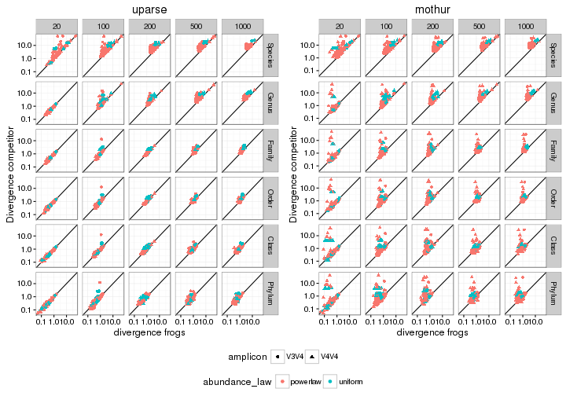
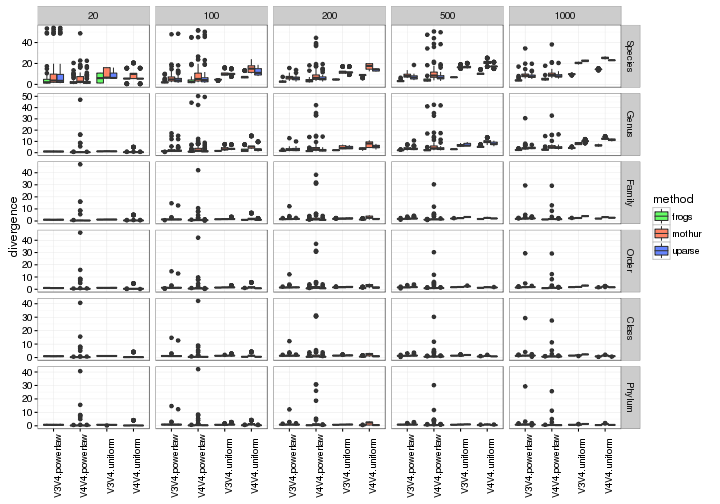
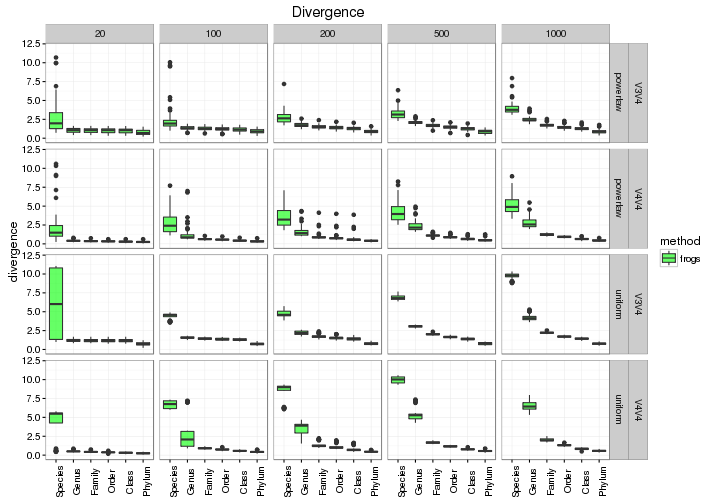
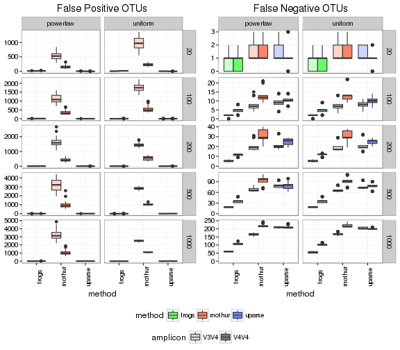
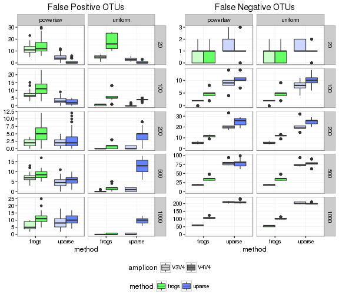
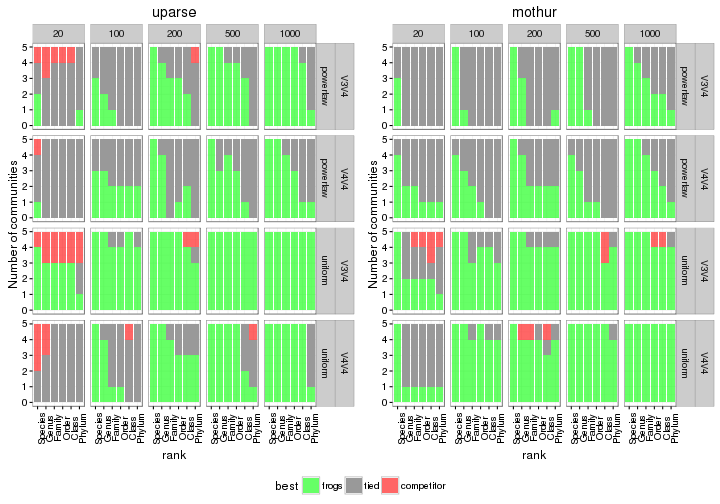
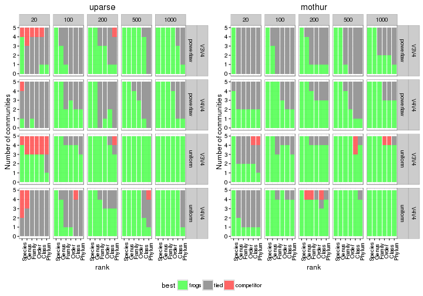
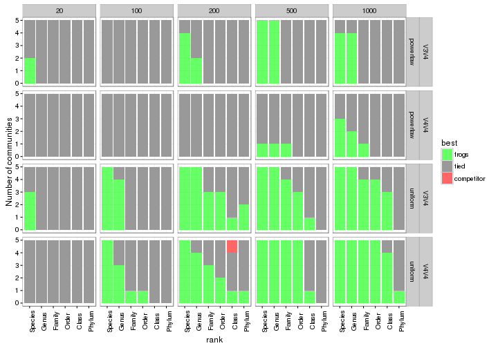
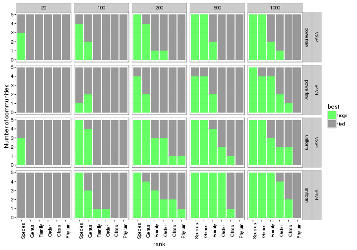
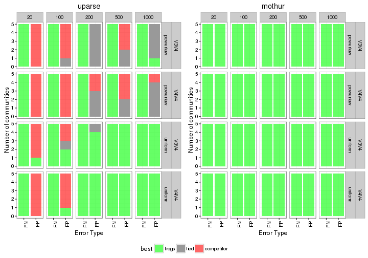

# Introduction 

Ce document R markdown a vocation à documenter la procédure suivie pour comparer les résultats de FROGS, Mothur et UParse sur les jeux de données simulées. En particulier, on cherche à savoir si Frogs permet d'avoir une vision taxonomique des communautés bactériennes plus fidèle que Mothur et UParse. 

# Import et préparation des données

## Chargement des packages

On commence par charger quelques packages utiles:
- reshape et dplyr pour la manipulation de données
- ggplot2, grid et gridExtra pour la visualisation
- PMCMR pour effectuer des tests de Dunn (version non paramétrique du test post-hoc de Tukey)


```r
library(ggplot2)
library(grid)
library(gridExtra)
library(reshape2)
library(PMCMR) ## The Pairwise Multiple Comparison of Mean Ranks Package (PMCMR)
library(multcomp)
library(dplyr)
```

et une fonction utilitaire pour combiner plusieurs graphiques ggplot:

```r
## http://stackoverflow.com/questions/13649473/add-a-common-legend-for-combined-ggplots
grid_arrange_shared_legend <- function(..., ncol = 1) {
  require(grid)
    plots <- list(...)
    if (length(plots) == 1) { ## already a list of plots
      plots <- plots[[1]]
    }
    g <- ggplotGrob(plots[[1]] + theme(legend.position="bottom"))$grobs
    legend <- g[[which(sapply(g, function(x) x$name) == "guide-box")]]
    lheight <- sum(legend$height)
    grid.arrange(
        do.call(arrangeGrob, c(lapply(plots, function(x)
            x + theme(legend.position="none")), ncol = ncol)),
        legend,
        nrow = 2,
        heights = unit.c(unit(1, "npc") - lheight, lheight))
}
generate_barplot <- function(p, data, vbl, ylab = "share of communities") {
  levs <- levels(data[[vbl]])
  result <- lapply(levs, 
                   function(lev) { p + geom_bar(data = filter_(data, 
                                                          lazyeval::interp(~variable == value, variable = as.name(vbl), value = lev))) + 
                                        labs(y = ylab) + ggtitle(lev)})
  return(result)
}

generate_pointplot <- function(p, data, vbl, ylab = "Divergence competitor") {
  levs <- levels(data[[vbl]])
  result <- lapply(levs, 
                   function(lev) { p + geom_point(data = filter_(data, 
                                                          lazyeval::interp(~variable == value, variable = as.name(vbl), value = lev))) + 
                                        labs(y = ylab) + ggtitle(lev)})
  return(result)
}
```

Et une palette manuelle de couleurs pour les graphiques. 

```r
manual.palette <- c("frogs"      = rgb(0, 1, 0, alpha = 0.6, maxColorValue = 1), 
                    "tied"       = "grey60", 
                    "competitor" = rgb(1, 0, 0, alpha = 0.6, maxColorValue = 1), 
                    "mothur"     = rgb(1, 0.2, 0, alpha = 0.6, maxColorValue = 1), 
                    "mothur_sop" = rgb(1, 0.5, 0, alpha = 0.6, maxColorValue = 1),                   
                    "uparse"     = rgb(0, 0.2, 1, alpha = 0.6, maxColorValue = 1), 
                    "uparse_sop" = rgb(0, 0.5, 1, alpha = 0.6, maxColorValue = 1))
```


## Import des données

On importe ensuite les données

```r
data <- read.table("silva.tsv", sep = "\t", header = TRUE)
head(data)
```

```
##   databank nb_OTU   dataset set_number amplicon abundance_law method
## 1    silva   20sp dataset_1       set1     V3V4      powerlaw mothur
## 2    silva   20sp dataset_1       set2     V3V4      powerlaw mothur
## 3    silva   20sp dataset_1       set3     V3V4      powerlaw mothur
## 4    silva   20sp dataset_1       set4     V3V4      powerlaw mothur
## 5    silva   20sp dataset_1       set5     V3V4      powerlaw mothur
## 6    silva   20sp dataset_1       set6     V3V4      powerlaw mothur
##    Species     Genus    Family     Order     Class    Phylum OTU.lost
## 1 3.301998 1.3995125 1.3182243 1.2685342 1.2080081 0.2456722       -1
## 2 5.280848 1.4678637 1.4275240 1.4275240 1.4275240 1.3442830       -1
## 3 1.711422 1.0088024 0.9995520 0.9995520 0.9995520 0.2911754       -1
## 4 1.925666 0.9188980 0.8272826 0.7641863 0.7547615 0.4669847       -1
## 5 5.346080 1.3983519 1.3514173 1.3503893 1.3341160 1.0098468       -1
## 6 4.630647 0.8412553 0.7950950 0.7659827 0.7659827 0.3455143       -1
##   OTU.false
## 1       391
## 2       544
## 3       576
## 4       843
## 5       443
## 6       487
```

## Transformation des données

Les différentes réponses d'intéret sont Species, Genus, Family, Order, Class, Phylum, OTU.lost, OTU.false stockées sur plusieurs colonnes. Avant toute chose, on change la variale nb_OTU en une variable numérique (pour retrouver un ordonnancement naturel) puis on sépare les informations sur le nombre de faux positifs et de faux négatifs dans un tableau distinct. 


```r
data$nb_OTU <- as.numeric(sub("sp", "", data$nb_OTU))
data.otus <- data %>% select(-one_of("Species", "Genus", "Family", "Order", "Class", "Phylum"))
```


Dans notre contexte on cherche à comparer les performances de mothur et silva à celles de frogs en termes de divergence à plusieurs niveaux taxonomiques. On va donc réorganiser le tableau en considérant que chaque "unité expérimentale"" est un jeu de données décrit à un niveau taxonomique donné par une méthode donnée et qu'on mesure dessus la divergence entre compositions mesurée et théorique. Cette structure est utile pour la visualtion et les anovas. 


```r
data <- data %>% select(-one_of("OTU.lost", "OTU.false")) %>%
  melt(id.vars = c("databank", "nb_OTU", "dataset", "set_number", "amplicon", "abundance_law", "method"), 
       value.name = "divergence", 
       variable.name = "rank")
head(data)
```

```
##   databank nb_OTU   dataset set_number amplicon abundance_law method
## 1    silva     20 dataset_1       set1     V3V4      powerlaw mothur
## 2    silva     20 dataset_1       set2     V3V4      powerlaw mothur
## 3    silva     20 dataset_1       set3     V3V4      powerlaw mothur
## 4    silva     20 dataset_1       set4     V3V4      powerlaw mothur
## 5    silva     20 dataset_1       set5     V3V4      powerlaw mothur
## 6    silva     20 dataset_1       set6     V3V4      powerlaw mothur
##      rank divergence
## 1 Species   3.301998
## 2 Species   5.280848
## 3 Species   1.711422
## 4 Species   1.925666
## 5 Species   5.346080
## 6 Species   4.630647
```

On va aussi construire un autre tableau qui intégre le fait que frogs constitue notre méthode de référence et qu'on compare, sur chaque échantillon, une méthode concurrente à la méthode de référence. 

```r
data.2 <- data %>% dcast(databank + nb_OTU + dataset + set_number + amplicon + abundance_law + rank ~ method) %>% 
  melt(id.vars = c("databank", "nb_OTU", "dataset", "set_number", "amplicon", "abundance_law", "rank", "frogs"), 
       value.name = "divergence", 
       variable.name = "method")
```

```
## Using divergence as value column: use value.var to override.
```

```r
head(data.2)
```

```
##   databank nb_OTU   dataset set_number amplicon abundance_law    rank
## 1    silva     20 dataset_1       set1     V3V4      powerlaw Species
## 2    silva     20 dataset_1       set1     V3V4      powerlaw   Genus
## 3    silva     20 dataset_1       set1     V3V4      powerlaw  Family
## 4    silva     20 dataset_1       set1     V3V4      powerlaw   Order
## 5    silva     20 dataset_1       set1     V3V4      powerlaw   Class
## 6    silva     20 dataset_1       set1     V3V4      powerlaw  Phylum
##       frogs method divergence
## 1 1.3004167 mothur  3.3019980
## 2 1.3004167 mothur  1.3995125
## 3 1.2301349 mothur  1.3182243
## 4 1.1895285 mothur  1.2685342
## 5 1.1389845 mothur  1.2080081
## 6 0.2175822 mothur  0.2456722
```
Dans data.2, *divergence* correspond à la divergence mesurée sur une méthode concurrente (renseignée dans *method*) tandis que *frogs* correspond à la divergence mesurée par FROGS. 

Finalement on change l'ordre des méthodes pour que les panels soient dans le bon ordre dans les graphiques

```r
data.2 <- data.2 %>% mutate(method = factor(method, levels = c("uparse", "mothur")))
```


## Visualisation des données

### Divergence 

Avant de s'attaquer aux tests, on va comparer visuellement les niveaux de divergence obtenus. Pour insister sur la structure pairée des données (les divergences sont mesurées sur les **mêmes échantillons**) et sur le fait que Frogs est la méthode de référence, on va comparer les taux de divergences de Mothur à Frogs et de Uparse à Frogs. 


```r
p <- ggplot(data = data.2, mapping = aes(x = frogs, y = divergence, color = abundance_law, shape = amplicon)) + facet_grid(rank ~ nb_OTU) + geom_abline(slope = 1, intercept = 0) + theme_bw() + scale_x_log10() + scale_y_log10() + xlab("divergence frogs")
plot.list <- generate_pointplot(p, data = data.2, vbl="method", ylab = "Divergence competitor")
grid_arrange_shared_legend(plot.list, ncol = 2)
```



On remarque que l'immense majorité des échantillons sont au dessus ou proche de la première bissectrice (droite y = x), ce qui signifie que FROGS a des performances meilleures ou comparables à ses deux concurrents. 

On peut aussi adopter une représentation plus classique des résultats à base de boxplot

```r
p <- ggplot(data, mapping = aes(x = interaction(amplicon, abundance_law), y = divergence, fill = method)) + facet_grid(rank ~ nb_OTU, scales = "free_y") + geom_boxplot() + theme_bw() + scale_y_continuous(limits = c(0, NA)) + theme(axis.text.x = element_text(angle = 90)) + scale_fill_manual(values = manual.palette) + xlab(NULL)
plot(p)
```



Ou se concentrer sur les performances de FROGS en termes de divergence.

```r
p <- ggplot(filter(data, method == "frogs"), mapping = aes(x = rank, y = divergence, fill = method)) + facet_grid(abundance_law + amplicon ~ nb_OTU, scales = "fixed") + geom_boxplot() + theme_bw() + scale_y_continuous(limits = c(0, 12)) + theme(axis.text.x = element_text(angle = 90)) + scale_fill_manual(values = manual.palette) + xlab(NULL) + ggtitle("Divergence")
plot(p)
```



### Faux positifs, faux négatifs
On peut aussi considérer le nombre de faux positifs et faux négatifs produits par chacune des 5 méthodes. La région V3V4 produit plus de faux positifs et moins de faux négatifs que la région V4V4. 

```r
p <- ggplot(data.otus, mapping = aes(x = method, fill = method, alpha = amplicon)) + facet_grid(nb_OTU ~ abundance_law, scales = "free_y") + theme_bw() + scale_y_continuous(limits = c(0, NA)) + theme(axis.text.x = element_text(angle = 90)) + scale_fill_manual(values = manual.palette) + scale_color_manual(values = manual.palette) + scale_alpha_discrete(guide = guide_legend(override.aes = list(fill = "grey10")), range = c(0.2, 0.6))
p.fn <- p + geom_boxplot(aes(y = -OTU.lost)) + ylab(NULL) + ggtitle("False Negative OTUs")
p.fp <- p + geom_boxplot(aes(y = OTU.false)) + ylab(NULL) + ggtitle("False Positive OTUs")
grid_arrange_shared_legend(p.fp, p.fn, ncol = 2)
```



Ou seulement par frogs, uparse et uparse_sop. On voit clairement que FROGS a de meilleurs performances en termes de faux négatifs et des performances comparables en termes de faux positifs (meilleurs pour une distribution uniforme, moins bonnes pour une distribution loi de puissance). 


```r
p <- ggplot(filter(data.otus, ! (method %in% c("mothur", "mothur_sop"))), mapping = aes(x = method, fill = method, alpha = amplicon)) + facet_grid(nb_OTU ~ abundance_law, scales = "free_y") + theme_bw() + scale_y_continuous(limits = c(0, NA)) + theme(axis.text.x = element_text()) + scale_fill_manual(values = manual.palette) + scale_color_manual(values = manual.palette) + scale_alpha_discrete(guide = guide_legend(override.aes = list(fill = "grey10")), range = c(0.2, 0.6))
p.fn <- p + geom_boxplot(aes(y = -OTU.lost)) + ylab(NULL) + ggtitle("False Negative OTUs")
p.fp <- p + geom_boxplot(aes(y = OTU.false)) + ylab(NULL) + ggtitle("False Positive OTUs")
grid_arrange_shared_legend(p.fp, p.fn, ncol = 2)
```




# Comparaison des méthodes: divergence

Le but de l'analyse est de comparer FROGS (considéré comme méthode de référence) à mothur et à uparse. On veut évaluer les performances de FROGS dans différentes régions de l'espace des paramètres définies par (1) un nombre d'OTUs, (2) une distribution d'abondances, (3) une région du 16S et (4) un rang taxonomique. Pour chacune de ces combinaisons, on a généré 10 communautés théorique différentes (*dataset*, qui reproduisent la variabilité biologique) et pour chaque communauté théorique, on a généré 10 jeux de lectures (*set_number*, qui reproduisent la variabilité technique). 

L'unité d'intéret la plus fine est la communauté théorique. Pour chaque communauté théorique, on veut savoir si FROGS reconstruit *mieux* la communauté que les méthodes concurrentes. Les réplicats techniques permettent de déterminer si la reconstruction de FROGS est *significativement* meilleure (ou pire) que celles de ses concurrentes. En aggrégant les résultats sur les communautés théoriques, on pourra déterminer dans quelles régions de l'espace des paramètres FROGS fait mieux, moins bien ou pareil que les méthodes concurrentes. 

## Tests pairés

### Test de student pairé 

Le test adopté (au niveau des réplicats techniques d'une communauté biologique) est un test de Student pairé (les divergences sur mesurées sur les mêmes échantillons). On peut aussi envisager sa contrepartie non-paramètrique: un test de Mann-Whitney contre l'hypothèse nulle $\mu = 0$ (pas de différence significative de divergence entre les méthodes). Cette étude est reportée à la section suivante. 


```r
data.t.test <- data.2 %>% group_by(databank, nb_OTU, dataset, amplicon, abundance_law, rank, method) %>% 
  summarize(pval = t.test(frogs, divergence, paired = TRUE)$p.value, 
            measure = t.test(frogs, divergence, paired = TRUE)$estimate) %>% 
  mutate(best = ifelse(measure >0, "competitor", "frogs")) %>% 
  mutate(best = ifelse(pval < 0.05, best, "tied")) %>%
  mutate(best = factor(best, levels = c("frogs", "tied", "competitor")))
data.t.test %>% select(measure, pval, best) %>% head()
```

```
## Source: local data frame [6 x 9]
## Groups: databank, nb_OTU, dataset, amplicon, abundance_law, rank [3]
## 
##   databank nb_OTU   dataset amplicon abundance_law    rank     measure
##     (fctr)  (dbl)    (fctr)   (fctr)        (fctr)  (fctr)       (dbl)
## 1    silva     20 dataset_1     V3V4      powerlaw Species -1.97526246
## 2    silva     20 dataset_1     V3V4      powerlaw Species -2.09159108
## 3    silva     20 dataset_1     V3V4      powerlaw   Genus  0.02241534
## 4    silva     20 dataset_1     V3V4      powerlaw   Genus  0.04358030
## 5    silva     20 dataset_1     V3V4      powerlaw  Family  0.02409343
## 6    silva     20 dataset_1     V3V4      powerlaw  Family  0.07374767
## Variables not shown: pval (dbl), best (fctr)
```

Dans le tableau précédent, la colonne *mesure* représente l'écart de divergence moyenn entre frogs et son compétiteur (pour une communauté théorique donnée), *pval* correspond à la p-valeur associée à cette écart et *best* indique la meilleure des deux méthodes (*frogs*, *competitor* ou *tied* si on ne peut pas les distinguer).

Il ne reste plus qu'à représenter les données pour savoir dans quelles circonstances frogs fait mieux que la compétition.

```r
p <- ggplot(mapping = aes(x = rank, fill = best)) + facet_grid(abundance_law + amplicon ~ nb_OTU) + theme_bw() + scale_fill_manual(values = manual.palette) + theme(axis.text.x = element_text(angle = 90))
plot.list <- generate_barplot(p, data = data.t.test, vbl = "method", ylab = "Number of communities")
grid_arrange_shared_legend(plot.list, ncol = 2)
```



Les graphiques montrent bien que dans la majorité des cas, FROGS est significativement meilleur ou équivalent à la méthode concurrente. FROGS fait mieux que la concurrence aux niveaux taxonomiques profonds (Species, Genus), en présence de beaucoup d'espèces et avec des distributions d'abondance uniformes. 

La seule situation dans laquelle FROGS fait pire que la concurrence est contre Uparse dans des communauté avec peu d'espèces (20). C'est probablement le reflet des filtres aggressifs de Uparse. 


### Test pairé non-paramétrique 

On adopte ici la même approche mais avec un test non paramétrique: un test de Mann-Whitney contre l'hypothèse nulle $\mu = 0$ (pas de différence significative de divergence entre les méthodes).  


```r
data.wilcox.test <- data.2 %>% group_by(databank, nb_OTU, dataset, amplicon, abundance_law, rank, method) %>% 
  summarize(pval = wilcox.test(frogs, divergence, paired = TRUE)$p.value, 
            measure = wilcox.test(frogs, divergence, paired = TRUE, conf.int = TRUE)$estimate) %>% 
  mutate(best = ifelse(measure >0, "competitor", "frogs")) %>% 
  mutate(best = ifelse(pval < 0.05, best, "tied")) %>%
  mutate(best = factor(best, levels = c("frogs", "tied", "competitor")))
data.wilcox.test %>% select(measure, pval, best) %>% head()
```

```
## Source: local data frame [6 x 9]
## Groups: databank, nb_OTU, dataset, amplicon, abundance_law, rank [3]
## 
##   databank nb_OTU   dataset amplicon abundance_law    rank     measure
##     (fctr)  (dbl)    (fctr)   (fctr)        (fctr)  (fctr)       (dbl)
## 1    silva     20 dataset_1     V3V4      powerlaw Species -2.04963154
## 2    silva     20 dataset_1     V3V4      powerlaw Species -2.14587531
## 3    silva     20 dataset_1     V3V4      powerlaw   Genus  0.02222643
## 4    silva     20 dataset_1     V3V4      powerlaw   Genus  0.06134262
## 5    silva     20 dataset_1     V3V4      powerlaw  Family  0.02477687
## 6    silva     20 dataset_1     V3V4      powerlaw  Family  0.09336344
## Variables not shown: pval (dbl), best (fctr)
```

Il ne reste plus qu'à représenter les données pour savoir dans quelles circonstances frogs fait mieux que la compétition.

```r
p <- ggplot(mapping = aes(x = rank, fill = best)) + facet_grid(abundance_law + amplicon ~ nb_OTU) + theme_bw() + scale_fill_manual(values = manual.palette) + theme(axis.text.x = element_text(angle = 90))
plot.list <- generate_barplot(p, data = data.wilcox.test, vbl = "method", ylab = "Number of communities")
grid_arrange_shared_legend(plot.list, ncol = 2)
```



avec les mêmes résultats que précédemment. 

## Tests non pairés

On commence par définir une fonction locale qui détermine (pour une communauté théorique) si frogs est la meilleure méthode ("frogs"), si elle est meilleure ex-aequo ("tied") ou une si une autre méthode fait strictement mieux ("other"). Les différences par rapport aux tests pairées sont (1) qu'on compare frogs à ses deux compétiteurs en même temps plutôt que de faire une comparaison par méthode et (2) que les tests ne sont plus pairés (on n'utilise pas l'information que les divergences sont mesurées sur les mêmes échantillons). Techniquement, il s'agit de tests multiples avec des contrastes contre une modalité de référence (ici frogs). La différence est basée sur le type de tests: ANOVA avec test post-hoc de Dunnett pour la version paramétrique, test de Kruskall-Wallis avec test post-hoc de Dunn pour la version non paramétrique (basée sur les rangs).

### Version paramétrique: Anova et test post-hoc de Dunnett


```r
determine_best <- function(x, y) {
  local.df <- data.frame(method = x, divergence = y)
  model <- lm(divergence ~ method, data = local.df)
  results <- fortify(summary(glht(model, linfct = mcp(method = "Dunnett"))))
  if (all(results$estimate >= 0 & results$p < 0.05)) {
    return("frogs")
  } else {
    better.method <- subset(results, p < 0.05 & estimate < 0)
    if (nrow(better.method)) {
      return("competitor")
    } else {
      return("tied")
    }
  }
}
```

avant d'appliquer cette fonction à chaque communauté théorique

```r
data.anova.test <- data %>% group_by(databank, nb_OTU, dataset, amplicon, abundance_law, rank) %>% 
  summarize(best = determine_best(method, divergence)) %>%
  mutate(best = factor(best, levels = c("frogs", "tied", "competitor")))
data.anova.test %>% head()
```

```
## Source: local data frame [6 x 7]
## Groups: databank, nb_OTU, dataset, amplicon, abundance_law [1]
## 
##   databank nb_OTU   dataset amplicon abundance_law    rank   best
##     (fctr)  (dbl)    (fctr)   (fctr)        (fctr)  (fctr) (fctr)
## 1    silva     20 dataset_1     V3V4      powerlaw Species  frogs
## 2    silva     20 dataset_1     V3V4      powerlaw   Genus   tied
## 3    silva     20 dataset_1     V3V4      powerlaw  Family   tied
## 4    silva     20 dataset_1     V3V4      powerlaw   Order   tied
## 5    silva     20 dataset_1     V3V4      powerlaw   Class   tied
## 6    silva     20 dataset_1     V3V4      powerlaw  Phylum   tied
```

On peut ensuite adopter la même représentation que précédemment

```r
p <- ggplot(data.anova.test, mapping = aes(x = rank, fill = best)) + facet_grid(abundance_law + amplicon ~ nb_OTU) + theme_bw() + scale_fill_manual(values = manual.palette) + theme(axis.text.x = element_text(angle = 90))
p <- p + geom_bar() + ylab("Number of communities")
plot(p)
```


Pour un petit nombre d'OTUs, FROGS fait mieux ou armes égales avec ses concurrents. Pour un nombre d'OTUs plus conséquent (à partir de 200), il commence à mieux marquer la différence. 

### Version non paramétrique: Kruskall-Wallis et test post-hoc de Dunn

Comme dans le cas paramétrique, on commence par définir une fonction locale qui détermine (pour une communauté théorique) si frogs est la meilleure méthode ("frogs"), si elle est meilleure ex-aequo ("tied") ou une si une autre méthode fait strictement mieux ("other"). La comparaison est basée sur un test de Dunn en utilisant frogs comme la modalité de contrôle. 


```r
determine_best_np <- function(x, g, method = "BH") {
  ## set frogs as reference factor
  g <- relevel(g, ref = "frogs")
  dunn.results <- dunn.test.control(x, g, p.adjust = method)
  results <- data.frame(method = rownames(dunn.results$p.value), 
                        p = as.numeric(dunn.results$p.value), 
                        estimate = as.numeric(dunn.results$statistic))
  if (all(results$estimate >= 0 & results$p < 0.05)) {
    return("frogs")
  } else {
    better.method <- subset(results, p < 0.05 & estimate < 0)
    if (nrow(better.method)) {
      return("competitor")
    } else {
      return("tied")
    }
  }
}
```

avant d'appliquer cette fonction à chaque communauté théorique

```r
data.dunn.test <- data %>% group_by(databank, nb_OTU, dataset, amplicon, abundance_law, rank) %>% 
  mutate(method = factor(method)) %>% 
  summarize(best = determine_best_np(divergence, method)) %>%
  mutate(best = factor(best, levels = c("frogs", "tied", "competitor")))
data.dunn.test %>% head()
```

```
## Source: local data frame [6 x 7]
## Groups: databank, nb_OTU, dataset, amplicon, abundance_law [1]
## 
##   databank nb_OTU   dataset amplicon abundance_law    rank   best
##     (fctr)  (dbl)    (fctr)   (fctr)        (fctr)  (fctr) (fctr)
## 1    silva     20 dataset_1     V3V4      powerlaw Species  frogs
## 2    silva     20 dataset_1     V3V4      powerlaw   Genus   tied
## 3    silva     20 dataset_1     V3V4      powerlaw  Family   tied
## 4    silva     20 dataset_1     V3V4      powerlaw   Order   tied
## 5    silva     20 dataset_1     V3V4      powerlaw   Class   tied
## 6    silva     20 dataset_1     V3V4      powerlaw  Phylum   tied
```

On peut ensuite adopter la même représentation que précédemment

```r
p <- ggplot(data.dunn.test, mapping = aes(x = rank, fill = best)) + facet_grid(abundance_law + amplicon ~ nb_OTU) + theme_bw() + scale_fill_manual(values = manual.palette) + theme(axis.text.x = element_text(angle = 90))
p <- p + geom_bar() + ylab("Number of communities")
plot(p)
```


Pour un petit nombre d'OTUs, FROGS fait mieux ou armes égales avec ses concurrents. Pour un nombre d'OTUs plus conséquent (à partir de 200), il commence à mieux marquer la différence.

# Comparaison des méthodes: faux positifs et faux négatifs

Pour comparer les faux positifs et faux négatifs, on va se contenter de faire des tests pairés (paramétriques et non paramétriques) en considérant frogs comme méthode de référence. On commence pour ce faire par formatter le tableau des données au format idéal:


```r
data.otus.2 <- data.otus %>% melt(id.vars = c("databank", "nb_OTU", "dataset", "set_number", "amplicon", "abundance_law", "method"), 
       value.name = "divergence", 
       variable.name = "error_type") %>% 
  dcast(databank + nb_OTU + dataset + set_number + amplicon + abundance_law + error_type ~ method) %>% 
  melt(id.vars = c("databank", "nb_OTU", "dataset", "set_number", 
                   "amplicon", "abundance_law", "error_type", "frogs"), 
       value.name = "divergence", 
       variable.name = "method") %>% 
  mutate(divergence = abs(divergence), 
         error_type = ifelse(error_type == "OTU.lost", "FN", "FP"))
```

```
## Using divergence as value column: use value.var to override.
```

Puis on change l'ordre des méthodes

```r
data.otus.2 <- data.otus.2 %>% mutate(method = factor(method, levels = c("uparse", "mothur")))
```


## Tests pairés

### Test de student pairé 

Le test adopté (au niveau des réplicats techniques d'une communauté biologique) est un test de Student pairé (les divergences sur mesurées sur les mêmes échantillons). On peut aussi envisager sa contrepartie non-paramètrique: un test de Mann-Whitney contre l'hypothèse nulle $\mu = 0$ (pas de différence significative de divergence entre les méthodes). Cette étude est reportée à la section suivante. 


```r
my.paired.t.test <- function(x, y, ...) {
  if (sd(x - y)) {
    t.test(x, y, paired = TRUE, ...)
  } else {
    return(list(p.value = 0, estimate = mean(x -y)))
  }
}
data.otus.t.test <- data.otus.2 %>% group_by(databank, nb_OTU, dataset, amplicon, abundance_law, error_type, method) %>% 
  summarize(pval = my.paired.t.test(frogs, divergence)$p.value, 
            measure = my.paired.t.test(frogs, divergence)$estimate) %>% 
  mutate(best = ifelse(measure > 0, "competitor", "frogs")) %>% 
  mutate(best = ifelse(pval < 0.05, best, "tied")) %>%
  mutate(best = factor(best, levels = c("frogs", "tied", "competitor")))
data.otus.t.test %>% select(measure, pval, best) %>% head()
```

```
## Source: local data frame [6 x 9]
## Groups: databank, nb_OTU, dataset, amplicon, abundance_law, error_type [3]
## 
##   databank nb_OTU   dataset amplicon abundance_law error_type measure
##     (fctr)  (dbl)    (fctr)   (fctr)        (fctr)      (chr)   (dbl)
## 1    silva     20 dataset_1     V3V4      powerlaw         FN    -1.0
## 2    silva     20 dataset_1     V3V4      powerlaw         FN    -1.0
## 3    silva     20 dataset_1     V3V4      powerlaw         FP     8.0
## 4    silva     20 dataset_1     V3V4      powerlaw         FP  -522.4
## 5    silva     20 dataset_1     V3V4       uniform         FN    -1.0
## 6    silva     20 dataset_1     V3V4       uniform         FN    -1.0
## Variables not shown: pval (dbl), best (fctr)
```

Dans le tableau précédent, la colonne *mesure* représente l'écart de divergence moyenn entre frogs et son compétiteur (pour une communauté théorique donnée), *pval* correspond à la p-valeur associée à cette écart et *best* indique la meilleure des deux méthodes (*frogs*, *competitor* ou *tied* si on ne peut pas les distinguer).

Il ne reste plus qu'à représenter les données pour savoir dans quelles circonstances frogs fait mieux que la compétition.

```r
p <- ggplot(mapping = aes(x = error_type, fill = best)) + facet_grid(abundance_law + amplicon ~ nb_OTU) + theme_bw() + scale_fill_manual(values = manual.palette) + theme(axis.text.x = element_text(angle = 90)) + xlab("Error Type")
plot.list <- generate_barplot(p, data = data.otus.t.test, vbl = "method", ylab = "Number of communities")
grid_arrange_shared_legend(plot.list, ncol = 2)
```



Les graphiques montrent bien que dans la majorité des cas, FROGS est significativement meilleur ou équivalent à la méthode concurrente. FROGS fait mieux que Mothur(normal ou SOP) dans tous les cas de figures et fait Uparse (normal ou SOP) dans beaucoup de situations. Uparse s'impose en termes faux positifs pour de petits jeux de données, dans des distributions de type de powerlaw et lors de l'étude du V3V4. En particulier pour des écosystèmes riches, FROGS fait strictement mieux ou pareil que Uparse. 


### Test pairé non-paramétrique 

On adopte ici la même approche mais avec un test non paramétrique: un test de Mann-Whitney contre l'hypothèse nulle $\mu = 0$ (pas de différence significative de divergence entre les méthodes).  


```r
my.paired.wilcox.test <- function(x, y, ...) {
  if (sd(x - y)) {
    wilcox.test(x, y, paired = TRUE, ...)
  } else {
    return(list(p.value = 0))
  }
}
data.otus.wilcox.test <- data.otus.2 %>% group_by(databank, nb_OTU, dataset, amplicon, abundance_law, error_type, method) %>% 
  summarize(pval = my.paired.wilcox.test(frogs, divergence)$p.value, 
            measure = sum(sign(frogs - divergence) * rank(abs(frogs - divergence)))) %>% 
  mutate(best = ifelse(measure >0, "competitor", "frogs")) %>% 
  mutate(best = ifelse(pval < 0.05, best, "tied")) %>%
  mutate(best = factor(best, levels = c("frogs", "tied", "competitor")))
data.otus.wilcox.test %>% select(measure, pval, best) %>% head()
```

```
## Source: local data frame [6 x 9]
## Groups: databank, nb_OTU, dataset, amplicon, abundance_law, error_type [3]
## 
##   databank nb_OTU   dataset amplicon abundance_law error_type measure
##     (fctr)  (dbl)    (fctr)   (fctr)        (fctr)      (chr)   (dbl)
## 1    silva     20 dataset_1     V3V4      powerlaw         FN     -55
## 2    silva     20 dataset_1     V3V4      powerlaw         FN     -55
## 3    silva     20 dataset_1     V3V4      powerlaw         FP      53
## 4    silva     20 dataset_1     V3V4      powerlaw         FP     -55
## 5    silva     20 dataset_1     V3V4       uniform         FN     -55
## 6    silva     20 dataset_1     V3V4       uniform         FN     -55
## Variables not shown: pval (dbl), best (fctr)
```

Il ne reste plus qu'à représenter les données pour savoir dans quelles circonstances frogs fait mieux que la compétition.

```r
p <- ggplot(mapping = aes(x = error_type, fill = best)) + facet_grid(abundance_law + amplicon ~ nb_OTU) + theme_bw() + scale_fill_manual(values = manual.palette) + theme(axis.text.x = element_text(angle = 90)) + xlab("Error Type")
plot.list <- generate_barplot(p, data = data.otus.wilcox.test, vbl = "method", ylab = "Number of communities")
grid_arrange_shared_legend(plot.list, ncol = 2)
```


avec les mêmes résultats que précédemment. 
